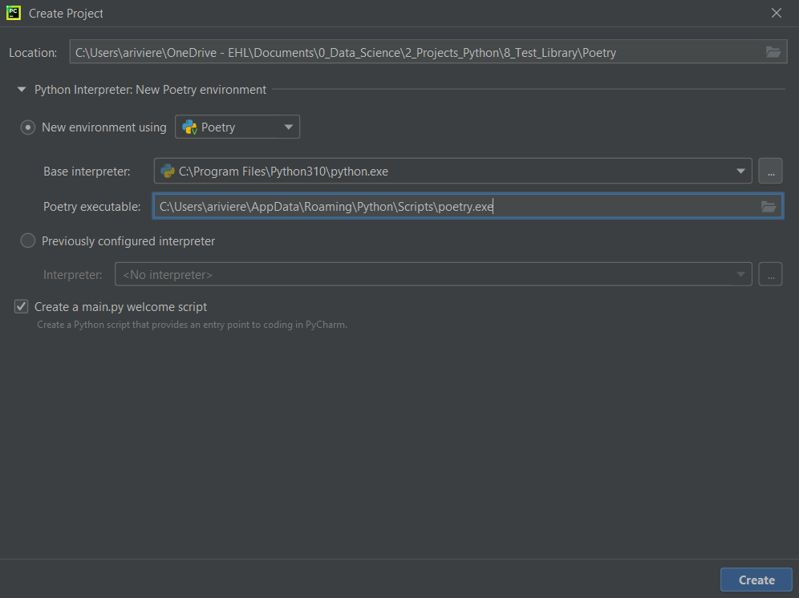
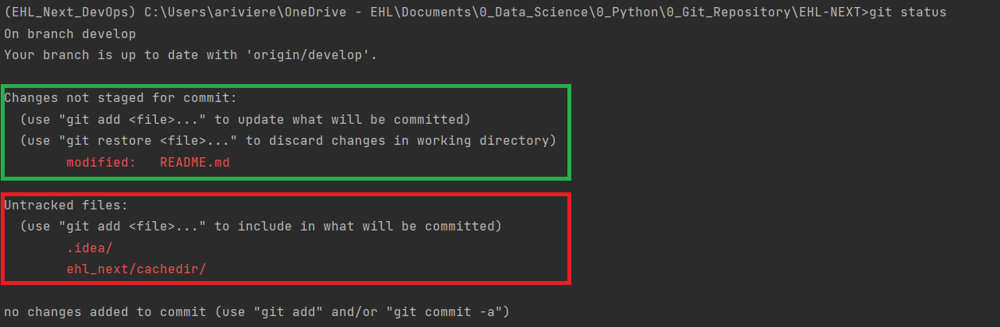
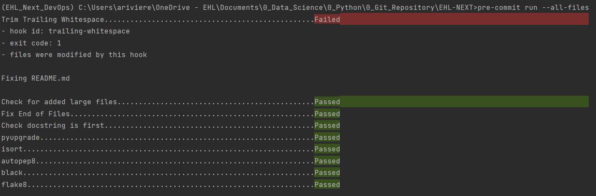
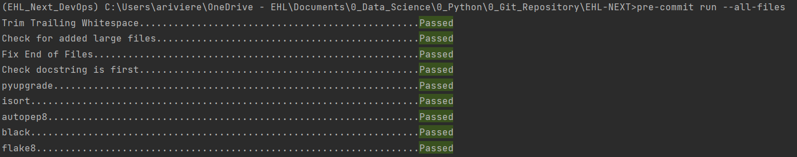

# Introduction

Marketing Data Ingestion with Python and Prefect.
- Facebook and Instagram
- Google Ads
- LinkedIn Ads
- Apple Search
- Twitter Ads
- Taboola
- Bing Ads

Copyright @2023 by Adrien RIVIERE. All rights reserved.

# Setup

## Requirements

* Python (>=3.11)
* Sphinx


## How to launch a pipeline


## Installation

- Step 1 : Download and install Pycharm

https://www.jetbrains.com/fr-fr/pycharm/download/#section=windows


- Step 2 : Install Poetry interpreter

Don't forget to install Python.exe first.
Basic installation on Windows (Windows PowerShell) :
```
(Invoke-WebRequest -Uri https://install.python-poetry.org -UseBasicParsing).Content | py -
```

Don’t forget to replace jetbrains with your name :
```
$Env:Path += ";C:\Users\jetbrains\AppData\Roaming\Python\Scripts"; setx PATH "$Env:Path”
```

In Pycharm :


## How to use Poetry

### Add library in the environment

To install a library in a Poetry environment you have 2 methods :

- In the Terminal :
```
poetry add pandas
```

- In the .toml file :
```
[tool.poetry.dependencies]
python = "^3.10"
pandas = "^1.5.0"
```

After the modification of the file .toml, execute the following command to generate a new lock file :
```
poetry lock
```

Then, execute this command to install all dependencies :
```
poetry install
```

### Managing dependencies

Poetry provides a way to organize  your dependencies by groups.
For instance, you might have dependencies that are only needed to test your project or to build the documentation.

```
[tool.poetry.group.dev]  # This part can be left out

[tool.poetry.group.docs]
optional = true

[tool.poetry.dependencies]  # main dependency group
httpx = "*"
pendulum = "*"

[tool.poetry.group.dev.dependencies] # dev dependency group
pytest = "^6.0.0"
pytest-mock = "*"
```

Optional groups can be installed in addition to the default dependencies :

```
poetry install --with docs
```

By default, dependencies across all non-optional groups will be installed when executing poetry install.
You can exclude one or more groups :

```
poetry install --without test,docs
```

## How to use pre-commit and create new features

### Pre-commit

- Step 0 : Install pre-commit

```
pre-commit install
```
This is the process of pre-commit :
- Step 1 : On your command prompt
```
git status
```
- Step 2 : Add only the files you want to commit (green square)

```
git add README.md
```
- Step 3 : Use the pre-commit before to commit
```
pre-commit run --all files
```


As you can see of the picture we got the first hook failed because we left some additional
whitespace into our code (README.md). But we are lucky because the precommit changed the file for us
(sometimes we have to do it manually).

After this step, we need to add again our file (because pre commit modified it) with the command git add
and run again the command :
```
pre-commit run --all files
```
Before to do any commit you have to have the all check list "passed" :


- Step 4 : Commit your modification
After the precommit, you can commit your file.
```
git commit -m "your message"
```

# Documentation

A complete documentation can be built using `Sphinx`. To do so, please follow the instructions from the project directory (command prompt):

```
cd docs
pip install -r requirements_sphinx.txt
make html
```

The documentation will be displayed on [http://0.0.0.0:8000/](http://0.0.0.0:8000/).
Or you can now open the file index.html (build repository) and explore the
documentation technique of the project EHL Next.

You can also generate a pdf out of the documentation. From the project directory:

```
cd docs
sphinx-build -b pdf source build/pdf
```

The file will then be in `build/pdf` with  name`doc.pdf`.

## List of tools

### Black

Black is a Python code formatter. It will reformat your entire file in place
according to the Black code style, which is pretty close to PEP8.

To quote the project README:

> Black is the uncompromising Python code formatter. By using it, you agree to
> cede control over minutiae of hand-formatting. In return, Black gives you speed,
> determinism, and freedom from `pycodestyle` nagging about formatting. You will
> save time and mental energy for more important matters.

- Configuration file: `pyproject.toml`
- Editor/IDE configuration: https://black.readthedocs.io/en/stable/editors.html

### Flake8

Flake8 is a Python library that wraps PyFlakes, pycodestyle and Ned Batchelder’s McCabe script.
It is a great toolkit for checking a code base against coding style (PEP8), programming errors
and to check cyclomatic complexity.

- Configuration file: `.flake8`
- PyCharm integration: https://realpython.com/pycharm-guide/#using-plugins-and-external-tools-in-pycharm
- VScode linter configuration: https://code.visualstudio.com/docs/python/linting

### Pylint

Pylint is a tool that checks for errors in Python code, tries to enforce a coding standard and
looks for code smells. It can also look for certain type errors, it can recommend suggestions
about how particular blocks can be refactored and can offer you details about the code's complexity.

- Configuration file: `.pylintrc`
- Editor/IDE configuration: http://pylint.pycqa.org/en/latest/user_guide/ide-integration.html

### PyUpgrade

PyUpgrade is a  tool (and pre-commit hook) to automatically upgrade syntax for newer versions of the language.

### iSort

iSort is a Python utility / library to sort imports alphabetically,
and automatically separated into sections and by type.
It provides a command line utility, Python library and plugins for various
editors to quickly sort all your imports.

### Autopep8

Autopep8 automatically formats Python code to conform to the PEP 8 style guide.
It uses the pycodestyle utility to determine what parts of the code needs to be formatted.
Autopep8 is capable of fixing most of the formatting issues that can be reported by pycodestyle

### Pep8-naming
Copyright © 2023 by Flowbank. All rights reserved.
